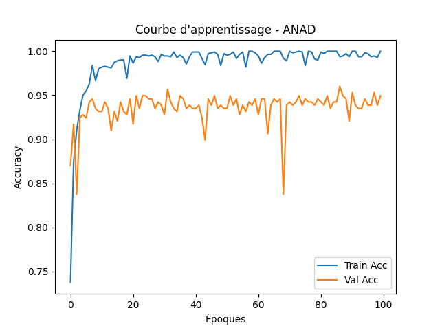

# Cross-Cultural Speech Emotion Analysis

This project analyzes emotions in speech across different cultures, focusing on how tone, language, and frequency reflect emotional states. It investigates cultural differences in vocal expression (e.g., loudness being perceived as normal in some societies) to improve understanding of cross-cultural emotional communication.

---

## 🚀 Features

* Emotion detection from speech using signal processing and machine learning.
* Cross-cultural analysis of tone, frequency, and intensity.
* Integration of **scikit-learn** and **TensorFlow** for training and evaluation.

---

## 🔧 Installation

### Prerequisites

Make sure you have **Python 3.9+** installed. You can check with:

```bash
python --version
```

### Clone the repository

```bash
git clone https://github.com/ridsougou/Emotion_analysis_project.git
cd Emotion_analysis_project
```

### Create a virtual environment (recommended)

```bash
python -m venv venv
source venv/bin/activate  # On Linux / Mac
venv\Scripts\activate     # On Windows
```

### Install dependencies

```bash
pip install -r requirements.txt
```

Or install the main libraries manually:

```bash
pip install scikit-learn tensorflow numpy librosa matplotlib
```

---

## ▶️ Usage

Train and run the model on your dataset:

```bash
python train.py --data ./dataset
```

Evaluate on test data:

```bash
python evaluate.py --model ./models/emotion_model.h5
```
## ▶️ Results

<p align="center">
  
</p>

---

## 📜 Owner

for any further questions or inquiries, please reach to ridsougou@gmail.com .
